---
title: CCTP simplifié
author: M. SMIRR - Bures-sur-Yvette
rights: MIT
language: fr-FR

documentclass: article
classoption:
    - a4paper
    - twosided
    - 12pt
    - french
geometry: margin=1cm
papersize: A4
header-includes:
    - \usepackage[T1]{fontenc}
    - \usepackage[utf8]{inputenc}
    - \usepackage{textcomp}
    - \usepackage{lmodern}
    - \usepackage{enumitem}
    - \usepackage{amsfonts}

lang: fr
numbersections: True    
toc: True
toc-title: "Sommaire"
toc-depth: 1
urlcolor: "red"
...

\setlist[itemize,1]{label=$\bullet$}
\setlist[itemize,2]{label=$\circ$}
\setlist[itemize,3]{label=$\star$}

\newpage

# Informations générales {-}

Le but de ce document est de décrire les besoins de rénovation d'une maison ancienne.

Le CCTP est décomposé par lot. L'artisan peut proposer un devis pour un ou plusieurs lots.

Des solutions techniques sont suggérées dans la description des lots, mais l'artisan peut proposer des solutions alternatives, surtout lorsque:

- la solution est plus économique (coût de matériau ou main d'oeuvre, possibilités de subventions)
- la solution est plus rapide à réaliser
- la solution est plus écologique
- la solution suggérée est impossible ou non-recommandée (merci d'expliquer succintement)

## Contact

Jean-Loup SMIRR

9 rue du Haras\
91440 Bures-sur-Yvette

06.64.02.00.66

bleuets@tuta.io

## Maison à rénover

3 rue des Bleuets\
91440 Bures-sur-Yvette

Promesse signée, signature de l'acte prévue mi-décembre.

Plans et photos en fin de document.

## Informations pratiques pour l'artisan

La maison dispose d'un "sous-sol" total **au rez de chaussée** pour entreposer du matériel avec grandes ouvertures côté cour et côté jardin. Les niveaux habitables sont situés au 1er et 2ème étage.

L'accès au sous-sol se fait par une voie bétonnée.

## Caractéristiques de la maison à rénover

Date de constructon : 1957

Murs :

- béton banché 20 cm avec pierre meulières coulées
- vide d'air 1 cm
- carreau de plâtre alvéolé 5 cm

Pièces :

- Niveau 0 (rez-de-chaussée) : "sous-sol" total + garage
- Niveau 1 : étage habitable (1 salon, 1 cuisine, 1 salle d'eau, 1 WC)
- Niveau 2 : étage habitable (2 chambres, 1 palier, 1 salle d'eau, 1 WC)

Surface habitable : 40 m² par étage habitable (80 m² total)

DPE : classe G, objectif de la rénovation : A ou B

\newpage

\part*{Description des lots}

# Couverture

## Charpente
Priorité : conservation de la charpente métallique existante (coût)

## Matériau
Type bacacier anthracite de préférence (isolé, voire section "Isolation de la toiture")

## Ouvertures
- Sortie pour conduit de poêle à bois (l'entrée d'air peut se faire à travers un mur).
- Sortie pour VMC double flux (l'entrée peut se faire à travers un mur).
- Pas de fenêtre de toit à prévoir.

Contrainte : PLU limité à 9 m, position des cheminées à adapter

## Extension (option)

Remplacer les 3 pans par 2 pans, avec extension sur le garage. Maçonnerie préalable (poteaux, complément de pignon) ou complément de charpente à discuter.

# Isolation de la toiture

Contraintes :

- R $\geq$ 6 m²K/W (plutôt 8 ?)
- PLU limité à 9m de haut (dérogation de +10/20cm pour bonne isolation ?)
- étanchéité à l'air
- continuité avec l'isolation par l'extérieur

## Option 1 : Panneau sandwich type bacacier.

Isolant de préférence laine de roche ou autre matériau à bonne isolation phonique.

Exemple : BATIROC

Panneau sandwich classique avec isolant polyuréthane/polyisocyanurate possible si garantie de bonne isolation phonique (possibilité de doubler par l'intérieur sans risque de dégradation par l'humidité)

### Références

- [Calepin de chantier PACTE](https://www.programmepacte.fr/sites/default/files/pdf/cccouverturespanneauxsandwichparementspolyurethaneneufrenomai17159web.pdf)
- Arcelor-Mittal[Ondatherm T](https://constructalia.arcelormittal.com/fr/catalogue_des_produits/ondatherm) : R=6.15 (ACERMI) pour 140mm
- Bacacier [COVISO 4.40](https://www.bacacier.com/fr/index.php?controller=attachment&id_attachment=206) mais e=120mm max (R=5.29)
- Batiroc [BATIPRO T](http://www.batiroc.com/media/documentation/CAT_Couverture_isolante.pdf) mais e=120mm max (R=5.29)
- Isopan [IsoCop](https://www.isopan.fr/system/files/eur_mt_gamma_isocop_rev.03_170831_fra.pdf) e=150mm, R=6.67

## Option 2 : Caisson chevronné

- si possible avec isolant laine de bois/verre/roche plutôt que polystyrène ou polyutéthane/polyisocyanurate.
- parement intérieur à définir, par exemple (par ordre de préférence)
    + lambris
    + panneau de bois
    + plâtre
- vérifier la nécessité ou pas d'un pare-vapeur

### Références

- [Comparatif 8 caissons/panneaux Système D](https://www.systemed.fr/charpente-couverture/huit-panneaux-isolants-toiture,4427.html)

## Option 3 : Sarking

- si compatible avec charpente existante
- de préférence sans PS/PU/PIR (laine de bois ?)

### Références

- Technique de [Sarking Isover](https://www.isover.fr/sites/isover.fr/files/assets/documents/Solution-Sarking-isolation-toiture-exterieur.pdf) (laine de verre & roche)
- 240mm de laine de bois avec [sarking Isonat](https://www.isonat.com/sites/isonat.com/files/documents/Isonat_Guide_Gamme_Rigide_Sarking_052020_V6.pdf)
- hybride 120mm PU + 35mm fibre de bois (dessus donc ventilé, déphasage 7h), parement étanche [Sarking L Comfort 155](https://www.unilininsulation.com/fr-fr/isolation-toiture-en-pente/sarking/isocombo/isocombo-sarking)
- 130mm mini de PU, avec pare-pluie intégré (pose facile et mise hors d'eau sans couverture) : [Unilin Utherm Sarking L plus](https://www.unilininsulation.com/fr-fr/isolation-toiture-en-pente/sarking/utherm-sarking/sarking-plus)
- idem ci-dessous, mais sans pare-pluie (mais parement étanche) (moins cher ?) : [Utherm Sarking K](https://www.unilininsulation.com/fr-fr/isolation-toiture-en-pente/sarking/utherm-sarking/sarking)
- 220mm nécessaire en polystèrène extrudé ?? [Isover Jackodur KF 300 NF](https://www.isover.fr/produits/catalogue/jackodur-kf-300-nf)
- 200mm nécessaire en laine de verre ?? (isolation "classique") [Isover Integra Reno](https://www.isover.fr/sites/isover.fr/files/assets/documents/systeme-Integra-Reno-isolation-toitures-exterieur.pdf)

## Option 4 : Sur-toiture

Avantages :

- pas de coût de retrait de la couverture existante (fibrociment amiantée)
- le plus simple ?

Inconvénients :

- sale boulot (?)
- nécessite un habillage intérieur étanche à l'air
- Perte de volument sous toiture (habillage sous pannes)

Détails :

- nettoyage de la couverture ondulée en fibrociment (amiante)
- chaulage (protection)
- pare-vapeur (si nécessaire)
- fixations adaptées pour sur-toiture en bac acier (par ex. Faynot, cf. références)
- nivellement par couche d'isolant déversé sur toiture (ouate de cellulose ?)
- laine de verre en 2 couches décalées épaisseur maximale (FENO : 175mm ?)
- bac acier
- habillage intérieur
    - BA13
    - frein vapeur
    - isolation entre pannes (par exemple polystyrène ou fibre de bois)

### Références

- [fixations Faynot pour ITE 120mm réf 800120-066](https://www.faynot.com/pilier-h120.html)
- [système de sur-couverture Faynot](https://www.faynot.com/surtoiture-couverture-double-peau-faynot)
- [Batiroc ISONOV](http://www.batiroc.com/media/documentation/CAT_Couverture_isolante.pdf) page 28 : plus solide ? mais moins de hauteur pour l'isolant et moins bon découplage thermique ?

# Isolation par l'extérieur

Contraintes :

- R $\geq$ 3.7 m²K/W (plutôt 5 ou +)
- continuité avec isolation de la toiture
- emplacement à prévoir pour coffres de volets roulants au-dessus des ouvertures (devant linteaux, à la place de l'isolant)

Niveau 0 non isolé (trop compliqué, pas urgent, risque d'inondation), sera isolé par l'intérieur au besoin pièce par pièce à l'avenir.

Les bacs maçonnés aux fenêtres seront démolis avant l'intervention.

## Option 1 : bardage

L'isolant doit être perspirant.

- 1ère couche : laine de verre/roche/bois (support non plan)
- 2ème couche (entre chevrons) : laine de verre/roche/bois
- pare-pluie nécessaire ?
- lame d'air
- bardage
    - horizontal ou vertical
    - préférentiellement en composite fibre de bois/polyéthylène (ex: Neowood, Fiberdeck)
    - éventuellement en bois naturel (si coût significativement inférieur et entretien facile)
    - PVC, ciment à éviter

PS : insufflation ouate de cellulose derrière coffrage possible ? Aussi fiable en extérieur que laine minérale ?

### Références

- [Guide PACTE](https://programmepacte.fr/sites/default/files/pdf/recommandation-pro-rage-ite-moe-procedes-bardages-rapporte-lame-air-ventilee-2015-05_0.pdf)
- [Calepin de chantier PACTE](https://www.programmepacte.fr/sites/default/files/pdf/ccprocedeisolationitebardagerapporteneufrenodec19210web.pdf) pour isolation sous bardage
- [Calepin de chantier PACTE](https://www.programmepacte.fr/sites/default/files/pdf/ccrevetementexterieursboisiteneufrenojuil19200v2web.pdf) pour pose de bardage
- Bardage composite fibre de bois-PEHD [Neowood](https://www.neowood.fr/91-gamme-sensation-lisse)
- Bardage compiste bibre de bois-PEHD [Fiberdeck](https://www.fiberdeck.fr/bardages/bardage-en-bois-composite-coextrude-garantie-20-ans-sans-decoloration/)

## Option 2 : enduit

Enduit possible si :

- coût comparable ou inférieur à bardage.
- compatible avec murs non plans (béton banché non régulier)
- éventuellement (mais semble mauvais pour l'hygrométrie) en 2 couches d'isolant : 1ère couche souple (laine de verre/roche) et 2ème couche rigide pour support d'enduit (panneaux de laine de bois préférentiellement, sinon polystyrène)
- enduit minéral type chaux ou plâtre/chaux
- finition grattée ou talochée

### Exemples

- Panneaux fibre de bois avec ou sans rainures, R=4.75 pour 20cm, R=5.70 pour 24cm [ISONAT Multisol 140](https://www.isonat.com/sites/isonat.com/files/documents/ISONAT_Depliant_ProduitsRigides_0.pdf). Version sans rainure a un $\lambda$ meilleur (0.041 au lieu de 0.042)
- STEICO protect L dry: panneau fibre de bois pré-enduit 0.039

# Menuiseries

## Performance
Uw $\leq$ 1,3 W/m².K et Sw $\geq$ 0,3

ou

Uw $\leq$ 1,7 W/m².K et Sw $\geq$ 0,36

## Pose

Buts :

- perte minimale de luminosité permettant l'ouverture par l'intérieur à ~90° au moins
- minimiser ponts thermiques
- coffre pour volets roulants au-dessus de l'ouverture (emplacement prévu dans le lot ITE)

Solution :

- Dormant en applique sur la partie extérieure de la maçonnerie avec joint d'étanchéité sur maçonnerie
- Dormant en contact avec l'isolant extérieur sur sa périphérie (lot ITE)

### Références

-  [Guide RAGE](https://www.programmepacte.fr/sites/default/files/pdf/guide-rage-menuiseries-exterieures-ite-2014-11_0.pdf) de pose des menuiseries en ITE. Voir page 78 pour F6 : pose en applique sur ITA avec bardage
- [Calepin de chantier RAGE](https://www.programmepacte.fr/sites/default/files/pdf/ccfenetresiteneufrenojuil17163web.pdf) correspondant
- Résumé du guide RAGE par [PACTE/CSTB](https://www.programmepacte.fr/sites/default/files/actualites/docs/Atelier%203_Menuiseries%20ext%C3%A9rieures%20et%20ITE.pdf)
- Calfeutrement des menuiseries par l'[Union des Fabricants de Menuiseries Extérieures](https://www.ufme.fr/sites/default/files/bibliotheque/calfeutrement.pdf) (en applique extérieur page 4)
- [Thèse Mathieu Bendouma (2019)](https://tel.archives-ouvertes.fr/tel-01975115)

## Liste des fenêtres

Les dimensions sont exprimées en HxL (en cm) de l'ouverture dans la maçonnerie

### Niveau 1

- 120x128 x1
- 130x145 x3 dont 2 oscillo-battantes éventuellement
- 130x188 x2

Dimensions standards immédiatement inférieures :

- 115x120
- 125x140
- 125x180

### Niveau 2

- 100x127 x2 dont 1 oscillo-battante éventuellement
- 100x160 x2 dont 1 oscillo-battante éventuellement

Dimensions standards immédiatement inférieures :

- 95x120
- 95x150 (voire 95x160 ?)

## Finition

A définir :

- PVC intérieur blanc, extérieur anthracite
- Bois vernis, teinte la plus claire possible
- Aluminium anthracite

Priorité: coût

Pas de couleur blanche à l'extérieur.

# Electricité

Saignées minimales dans murs

1 tableau par étage

Gaines possibles dans plancher si nivellement par chape (sèche ou béton)

Gaines possibles dans combles (chauds : isolation par l'extérieur ou sous rampants) du Niveau 2 et du Niveau 1 (si faux plafond)

Gaines possibles par passage par le sous-sol

# Plomberie

PER, multicouche, cuivre... peu importe.

# Ventilation

Pré-équipement des conduits pour VMC double flux. Entrée d'air par un mur possible. Expulsion en toiture.

### Références

- [Guide PACTE](https://www.programmepacte.fr/sites/default/files/pdf/gvmcdoublefluxhabitatindividuelneufoct18188web.pdf) de la VMC double flux
- [Calepin de chantier PACTE](https://www.programmepacte.fr/sites/default/files/pdf/ccvmcdoublefluxhabindneufrenoavr17155web.pdf)
- [VMC : performance et retour d'expérience - Rapport PACTE](https://www.programmepacte.fr/sites/default/files/pdf/rapport-rage-ventilation-double-flux-2015-02_0.pdf)
- [Diffusiuon d'air double flux - Rapport PACTE](https://www.programmepacte.fr/sites/default/files/pdf/rapport-rage-solutions-diffusion-air-ventilation-double-flux-habitat-2014-06.pdf)
- [Fiche interface AQC VMC double flux](https://qualiteconstruction.com/fiche/vmc-double-flux/)

# Chauffage

Actuellement : radiateurs électriques à inertie

- sous plancher hydraulique au moins dans le salon, éventuellement dans cuisine
- complément par convecteurs électriques
- complément par poêle à bois dans le salon ou proche entrée ?

### Références

- [Fiche interface AQC plancher chauffant](https://qualiteconstruction.com/fiche/plancher-chauffant-avec-revetement-de-sol/)

# Finition intérieure des murs

Actuellement : peinture glycéro et papier-peint sur carreau de plâtre

Couleur : blanc, blanc cassé, sable au pire

## Option 1

- Enduit lisse chaux-plâtre (3vol plâtre gros, 1vol chaux aérienne, 2vol charge)
    - charge : sable très fin ? craie ? blanc de Meudon ? poudre de marbre ?
    - adjuvants/"cirage" nécessaire ? (pour lessivabilité)
- Enduit lisse chaux plutôt que chaux-plâtre (mais n'adhère pas sur plâtre sans préparation du support ? Quelle préparation ?) 
- Enduit classique + peinture

## Option 2

BA13 collé sur murs, joints enduits, peinture.

### Références

- [Thèse de doctorat sur les enduits de façade en plâtre](https://tel.archives-ouvertes.fr/tel-02067379) avec discussion sur les mélanges plâtre-chaux-sable et la possibilité de réduire la quantité de sable (page 351)
- Voir DTU 26.1 pour enduit chaux-plâtre
- [Article en ligne sur le plâtre et la chaux](thesustainablehome.net/binders-part-2-gypsum-and-lime/)
- [Super article scientifique](https://www.sciencedirect.com/science/article/pii/S0950061813006788) sur les nouvelles recettes de plâtre et de chaux
- Enduit [Webermur intérieur](https://www.fr.weber/files/fr/2018-01/fiche_imprimable_webermur_intrieur.pdf) à base de plâtre avec charges et adjuvants, pour ragréage et lissage. PAS SUR PEINTURE

# Finition des plafonds

Actuellement : (incertain) peinture glycéro sur plâtre sur hourdis brique avec poutres acier

Couleur : blanc 

## Option 1

- Décapage + enduit classique + peinture mate
- Décapage + enduit chaux-plâtre ? chaux ? (comme murs)
    + mais problème d'adhésion au niveau des poutres en acier ?

## Option 2

BA13 sur structure :

- bois ?
- métallique

puis enduit + peinture

## Option 3

Lambris teinte claire (plutôt blanche) :

- MDF plaqué bois blanchi ?
- Pin massif ? blanchi ?

PVC à éviter

# Finition des sols

Actuellement : Carrelage (à conserver) sur plancher hourdis (poutres acier, entrevous brique, dalle béton). Pente environ 1% (5cm sur 5m).

## Nivellement où nécessaire

Superposition suivante, pour éviter une chape béton ? 

- membrane étanche
- passage gaines électriques dans zone basse
- chape sèche en granules de Fermacell ou autre (vermiculite ?)
- dalles bois (OSB ou autre) ou plaques Fermacell ou BA13 ?

## Finition niveau 1 salon

Avec plancher chauffant hydraulique (sur couche de nivellement avec dalles bois) :

- empreinte pour tuyaux PER à la défonceuse
- couche de diffusion métallique (préfabriquées ? Feuilles souples ?)
- parquet flottant

Sans plancher chauffant :

- parquet flottant simple sur les couches de nivellement ?
- parquet cloué nivelé par lambourdes directement sur carrelage existant ?

## Finition niveau 1 cuisine

- stratifié ou parquet sur nivellement
- autre plancher sur nivellement ?
- carrelage sur chape béton

## Finition niveau 1 salle de bains

Comme cuisine, mais contrainte différente : anti-humidité plutôt qu'anti-tâches. Par exemple dalles de liège possibles, mais parquet non-traité impossible ?

## Finition niveau 2 chambres

Comme niveau 1 salon sans plancher chauffant

- parquet flottant (nivellement par chape sèche) ?
- parquet cloué (nivellement par lambourdes) ?

## Finition niveau 2 salle de bains

Comme SdB Niveau 1 ?

# Références générales

- [Rapport PACTE sur la rénovation](https://www.programmepacte.fr/sites/default/files/pdf/rstrategierenooct17075web.pdf)
- [Memento d'étanchéité à l'air](https://www.durabilitair.com/cerema/ressources/guides/00_Memento_Etancheite.pdf)
- [Isolation Thermique par l’Extérieur sous bardage rapporté (Isover)](https://www.isover.fr/sites/isover.fr/files/assets/documents/isolation-thermique-mur-exterieur-maison-individuelle-bardage-rapporte-isofacade-ITE.pdf)
- [Guide Isover - La thermique du bâtiment](https://www.isover.fr/sites/isover.fr/files/assets/documents/Isolation_thermique_guide_%20Isover.pdf)
- [Guide ADEME - RT2012 et étanchéité à l'air](http://ww2.ac-poitiers.fr/electrotechnique/sites/electrotechnique/IMG/pdf/4-b_-_rt2012_etancheite_a_l_air_2_par_page.pdf)
- Rapport Agence Qualité Construction [Isolants biosourcés : points de vigilance](https://qualiteconstruction.com/publication/isolants-biosources-points-de-vigilance/)
- Resources téléchargeables [Agence Qualité Construction](https://qualiteconstruction.com/nos-ressources/)
- Rapport PACTE [Stratégie de rénovation](https://www.programmepacte.fr/sites/default/files/pdf/rstrategierenooct17075web.pdf)
- [Ragréages Weber](https://www.fr.weber/search-content/content_type/product/activities/les-ragreages-et-mortiers-de-lissage-44)
- Ragréage autonivelant Weber pour extérieur, ajout possible de sable [weberniv lex](https://www.fr.weber/files/fr/2020-07/fiche_produit_-_weberniv_lex.pdf)
- Ragréage Weber fibré autolissant (pas autonivelant) épais pour intérieur [weberniv dur](https://www.fr.weber/files/fr/2020-07/fiche_produit_-_weberniv_dur.pdf)
- Enduit de sol coloré [weberniv color](https://www.fr.weber/preparation-et-finition-des-sols/les-revetements-de-sols-decoratifs-et-sols-industriels/weberniv-color)
- protection des enduits de sol coloré : weberfloot TOP matt (cire), weberfloor protect (vernis), weberklin sol (bouche-pores)
- [Ravoirage léger Weber](https://www.fr.weber/files/fr/2018-02/fiche_imprimable_weber_ravoirage_lger.pdf) 0.15 W/m.K
- Enduit d'interposition à la chaux aérienne avant enduit de finition à la chaux [weberbase facim moyen](https://www.fr.weber/renovation-de-facade/les-sous-enduits/weberbase-facim-moyen) (existe en grain fin)
- Enduit de finition et sous-enduit à la chaux aérienne [webertop universel](https://www.fr.weber/files/fr/2018-01/fiche_imprimable_webertop_universel.pdf)
- 

\newpage

\part*{Photos et plans}

{width=100%}

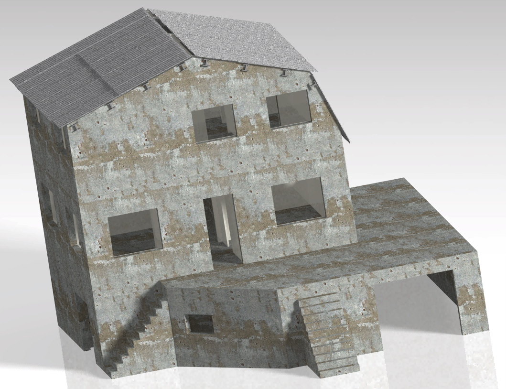{width=100%}

{width=100%}

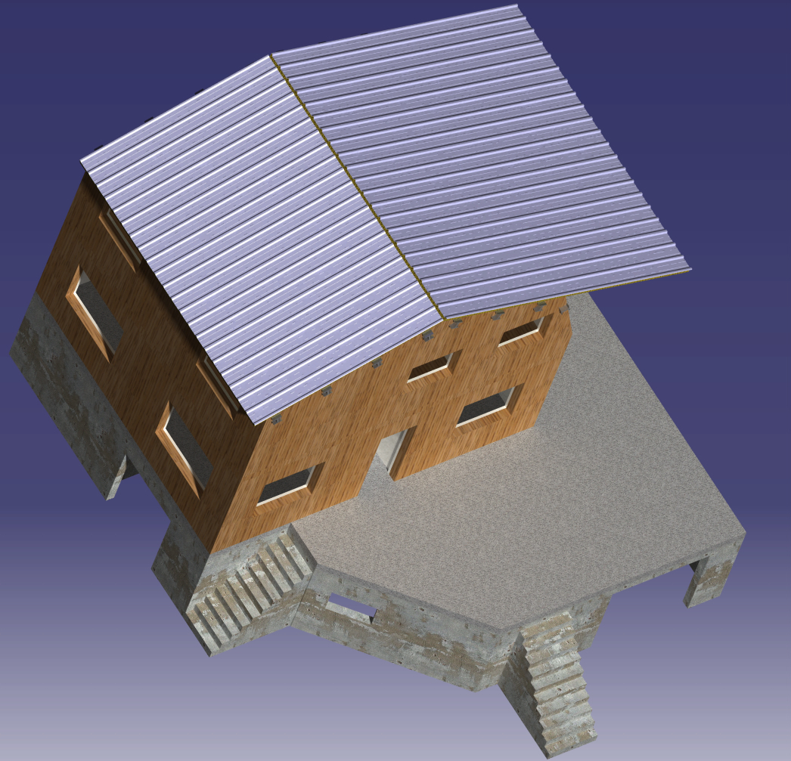{width=100%}

{width=100%}

<!-- {width=100%} -->

{width=100%}

<!-- 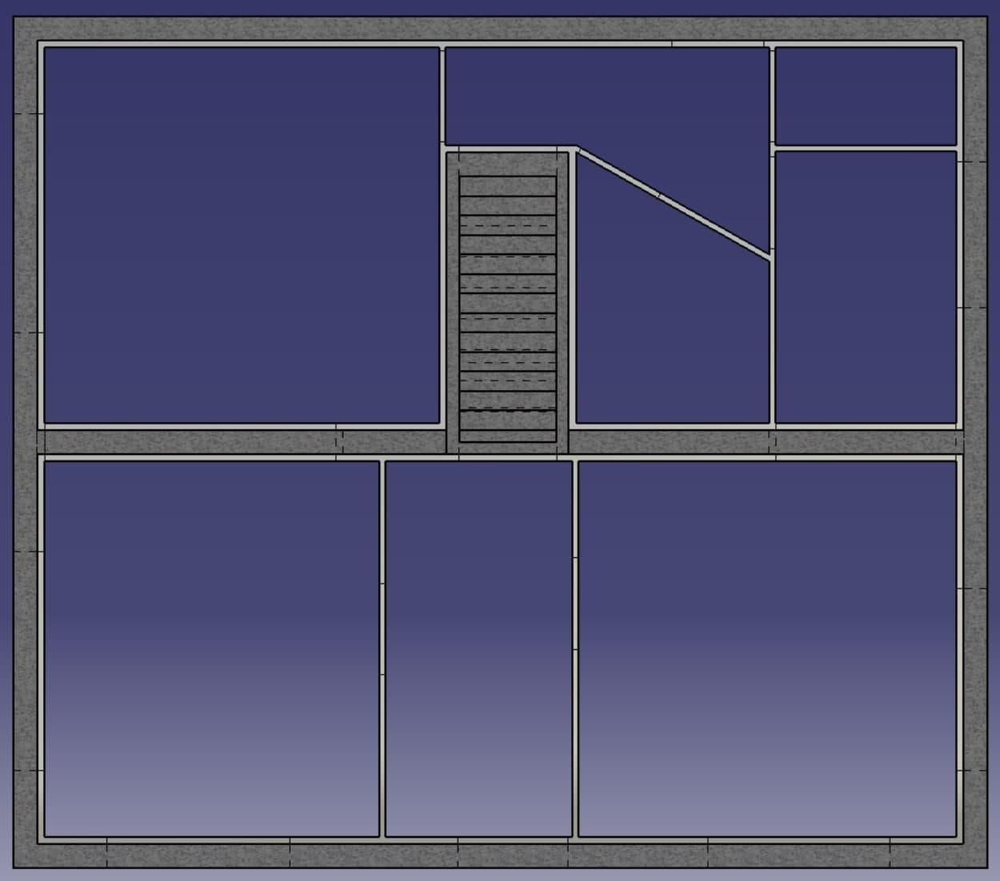{width=100%} -->

{width=100%}

<!-- 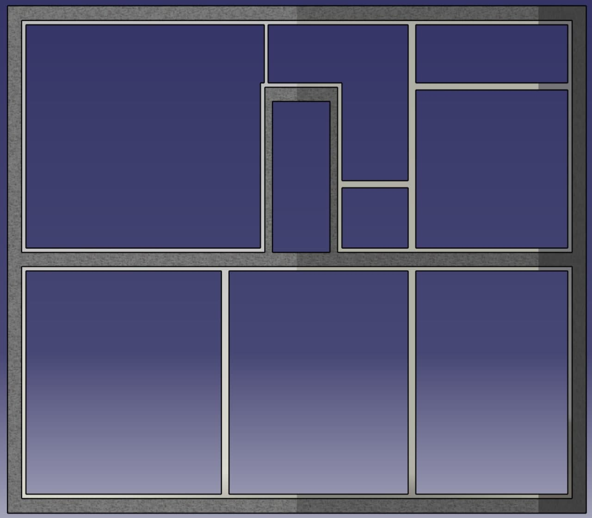{width=100%} -->

{width=100%}

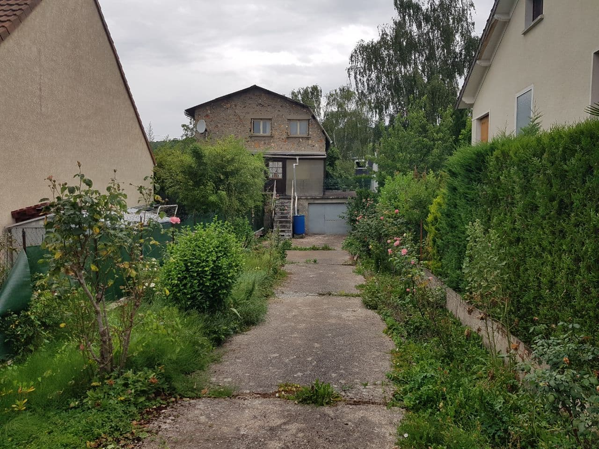{width=100%}

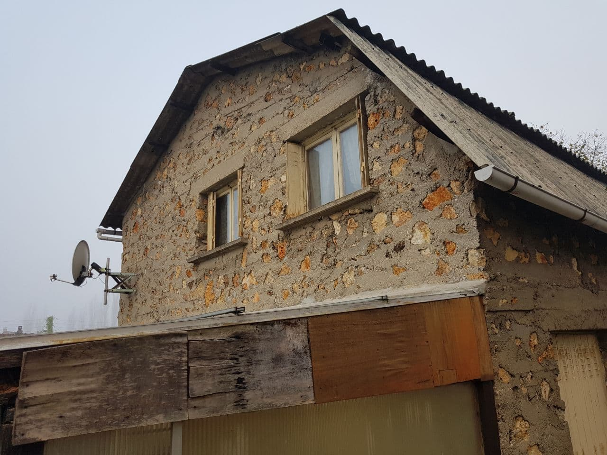{width=100%}

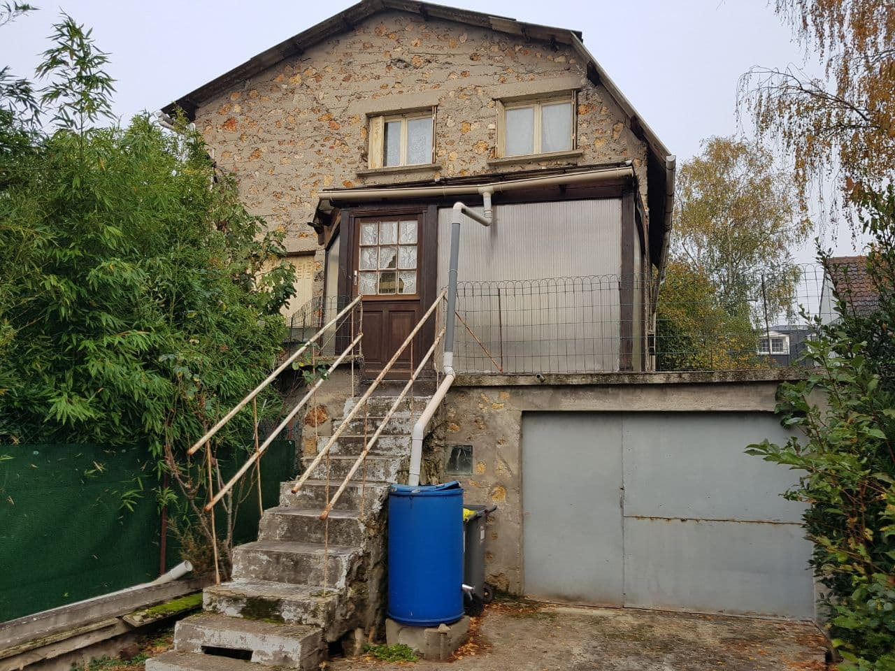{width=100%}

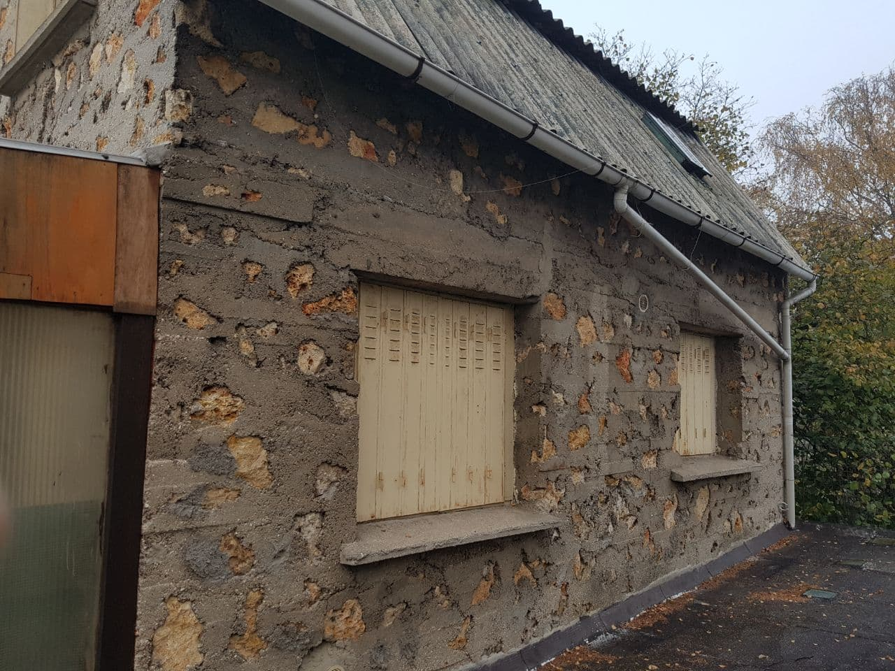{width=100%}

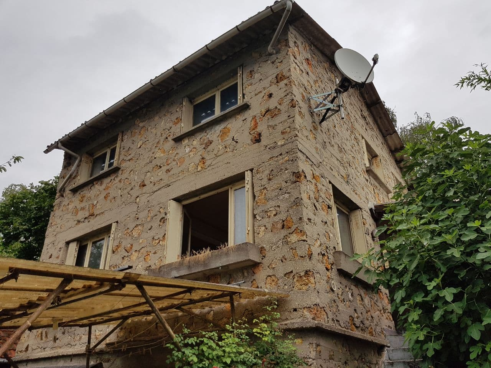{width=100%}

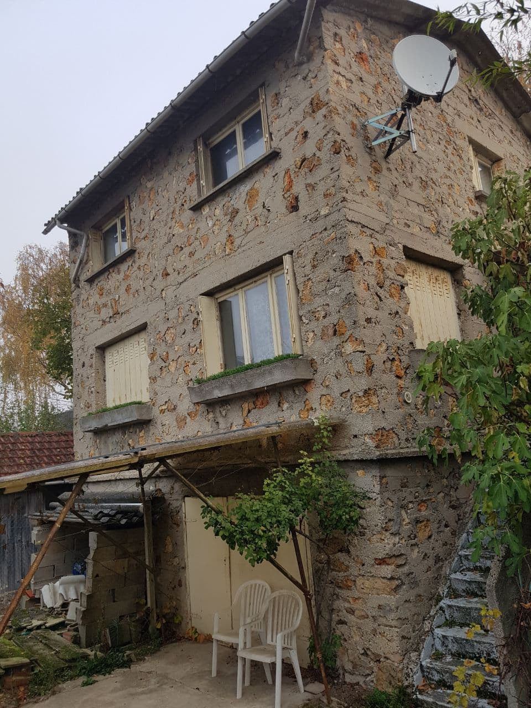{width=100%}

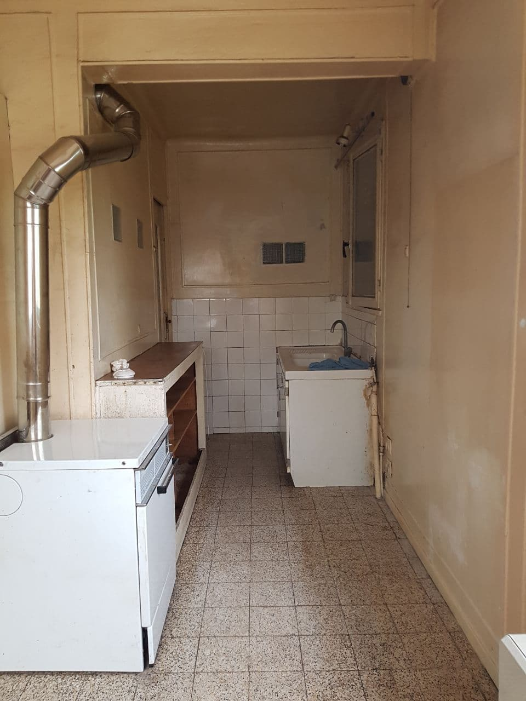{width=100%}

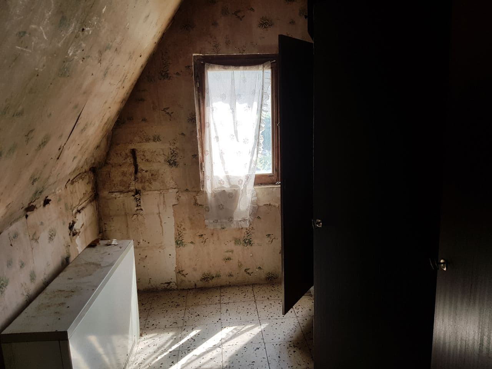{width=100%}

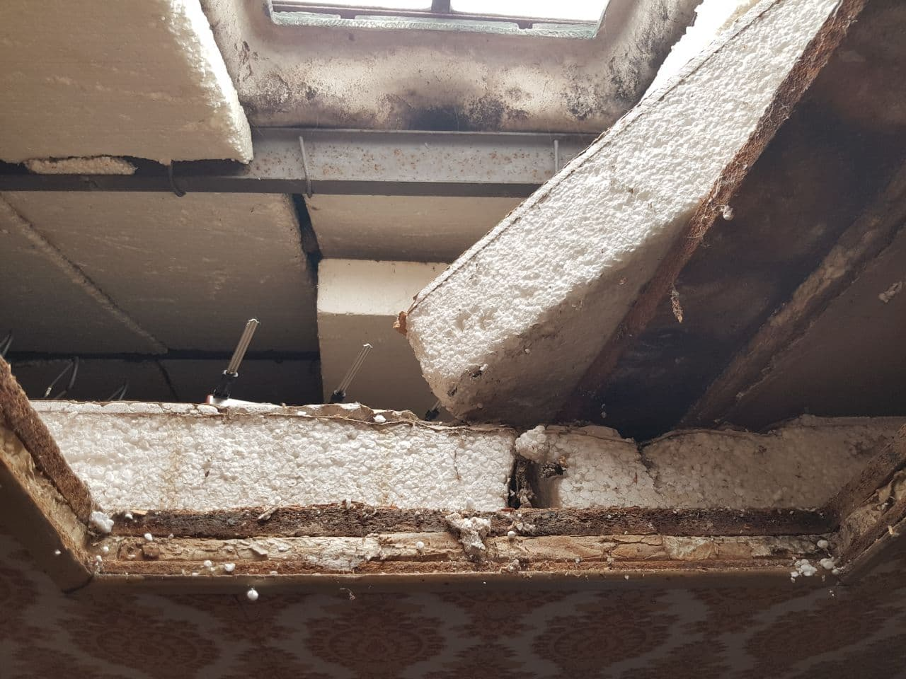{width=100%}